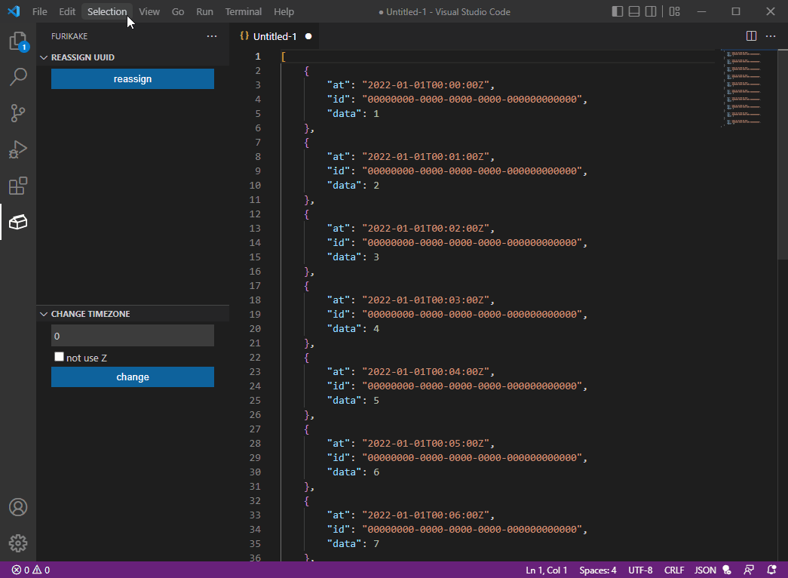
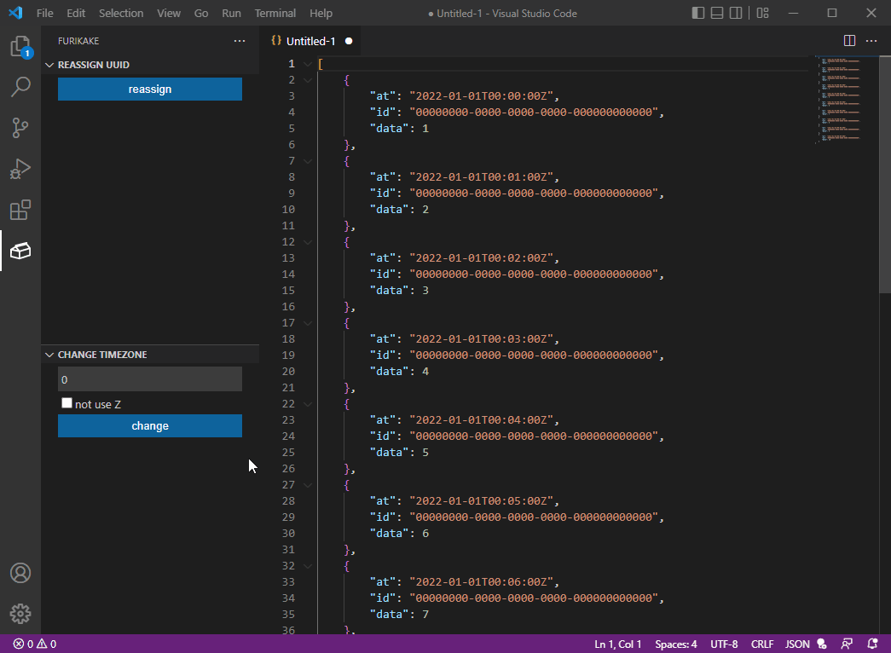

# Furikake

This extension is a collection of useful tools when creating data such as test data.

---

## Features

### Reassign UUID

Reassigns the UUID entered in the editor.

### Change Timezone

Changes the time zone of the date and time (ISO8601 extended format) entered in the editor.

---

## Release Notes

Please check [CHANGELOG.md](./CHANGELOG.md) for change history.

**Enjoy!**
